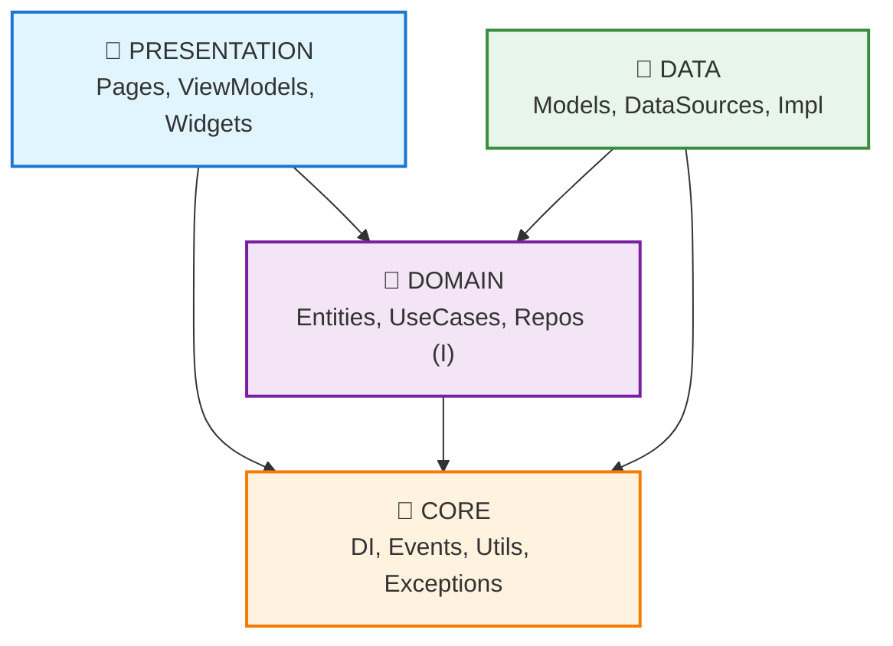
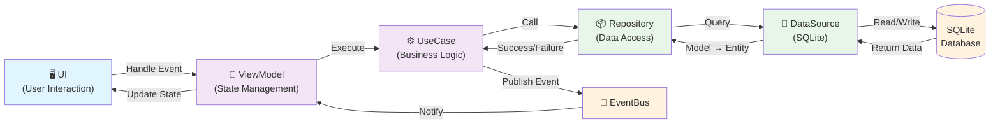
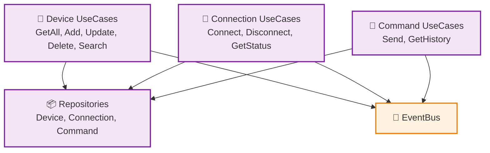
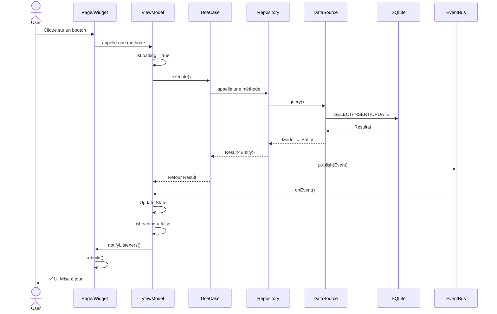
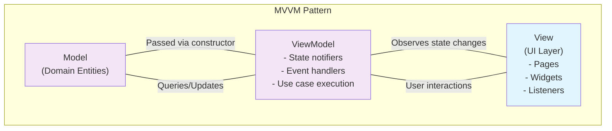
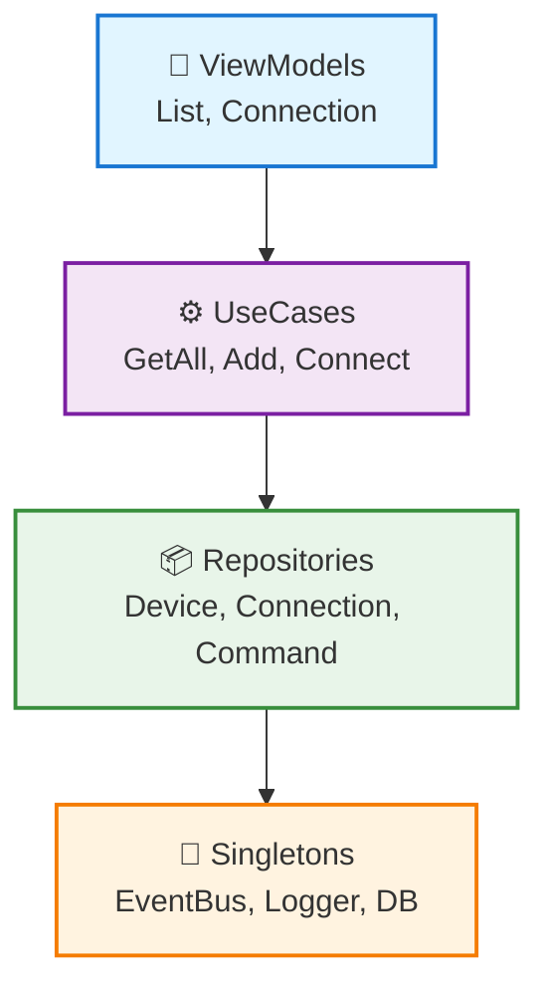
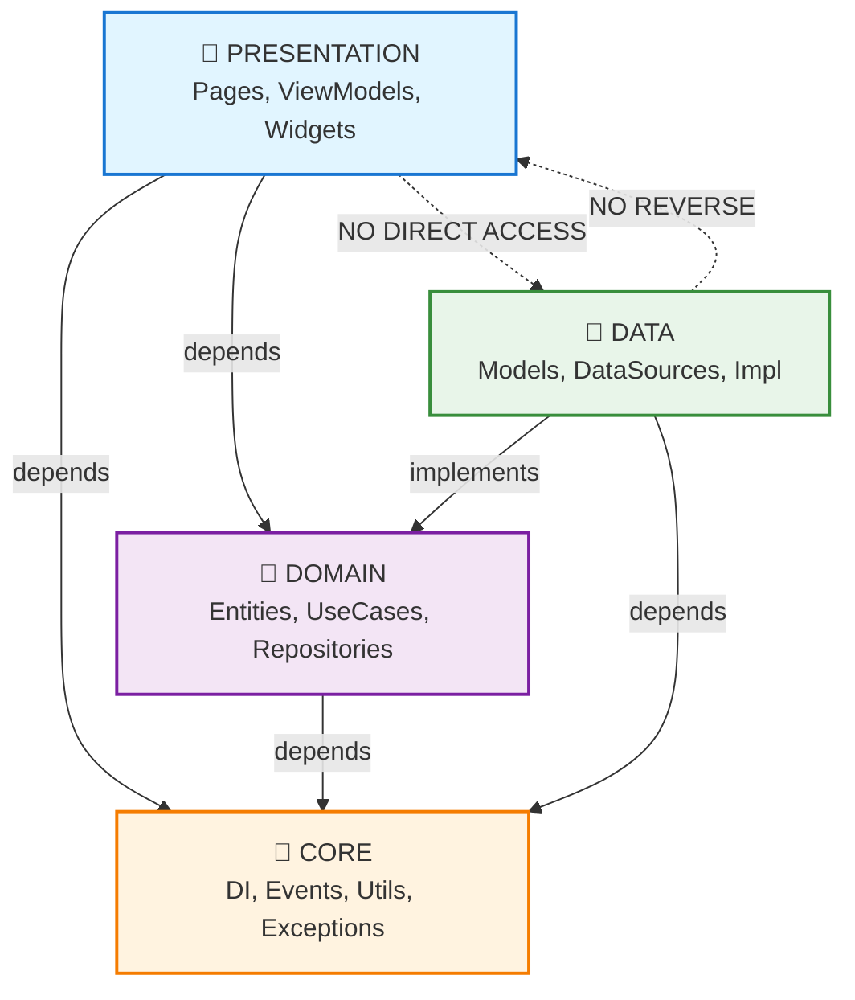
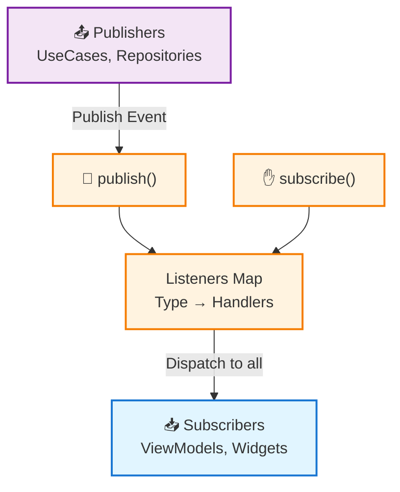
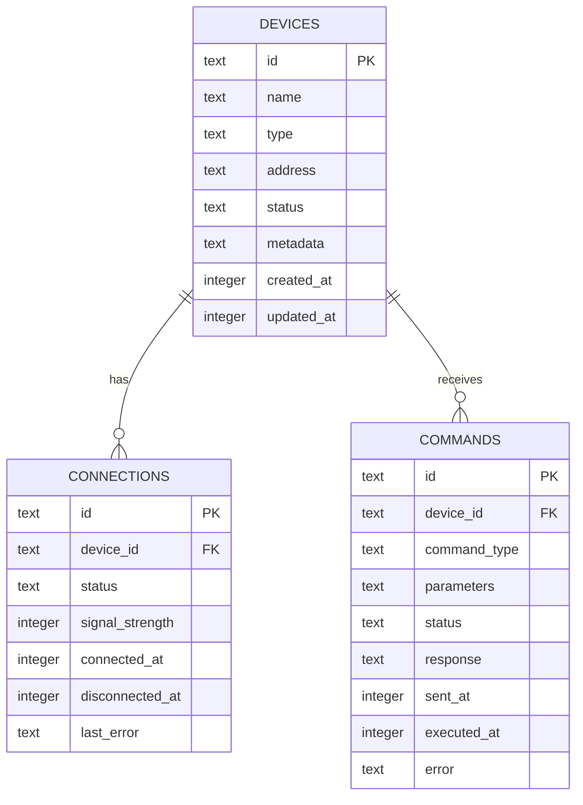
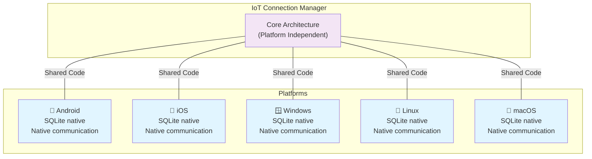

# Diagrammes des dépendances - IoT Connection Manager

## 1️⃣ Diagramme d'architecture en couches

## 2️⃣ Flux des données (Data Flow)

## 3️⃣ Dépendances des UseCases

## 4️⃣ Cycle de vie des événements

## 5️⃣ Architecture MVVM - Flux détaillé

## 6️⃣ Injection de dépendances

## 7️⃣ Relations entre les couches (Dependency Rules)

## 8️⃣ Event Bus - Architecture complète

## 9️⃣ SQLite Schema - Relations

## 🔟 Platform-specific Considerations

